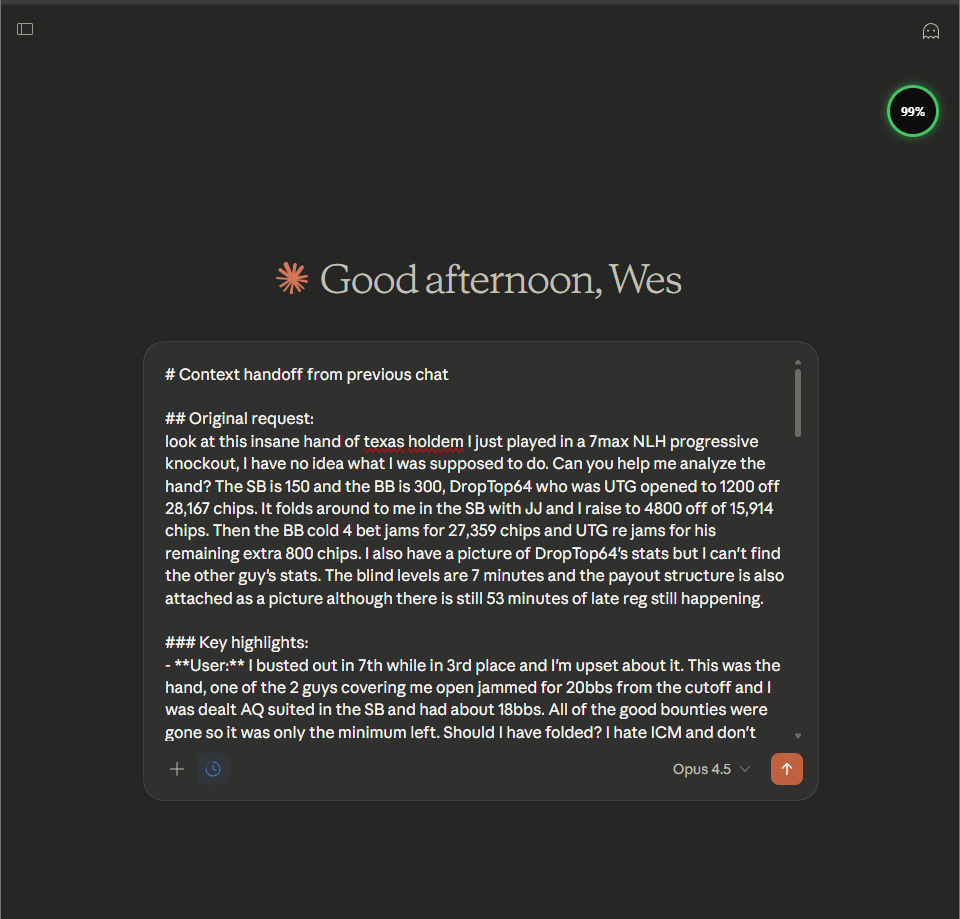
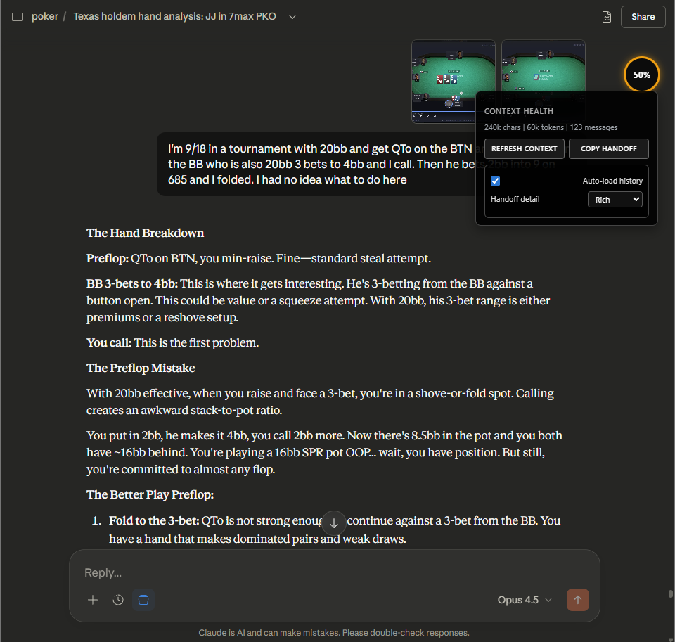

# Context Health Bar for Claude

A Chrome extension that visualizes Claude context health as a compact orb and helps you hand off long chats to a fresh conversation.

## What It Does

Context Health Bar gives a real-time, heuristic signal for when Claude may start degrading due to instruction drift and long context. It does not read Claude's internal state and does not track or send data anywhere.

## Features

- Compact orb UI with colored ring and percentage (green, yellow, red)
- Hover panel with char/token/message stats
- Manual pinning of important user messages
- Auto-detect core instructions
- Refresh Context handoff (opens a new chat with a formatted summary)
- Copy Handoff button (clipboard fallback)
- Auto-load history (pulls older messages into the DOM)
- Handoff detail level: compact / standard / rich

## Installation (Local)

1. Open `chrome://extensions/`
2. Enable Developer mode
3. Click "Load unpacked"
4. Select this folder

## Usage

- The orb appears at the top-right. Hover to see stats and settings.
- Click Refresh Context when health drops. It opens a new Claude chat and inserts a formatted handoff.
- Click Copy Handoff if you want to paste the handoff manually.
- Hover over a user message to pin it; pinned messages are treated as core instructions.

## Release Zip (GitHub)

Create a clean zip for releases:

```powershell
.\scripts\package.ps1
```

This outputs `dist\context-health-bar.zip`. Upload that file to a GitHub Release.

## Screenshots (Optional but Recommended)

Add two screenshots to help new users:

1. Orb UI on a Claude chat
2. Hover panel with stats and settings

Place them in `docs/screenshots/` and update this section with image links:






## How Health Is Calculated

Health starts at 100 and drops based on three factors:

1. Instruction distance
   - If the last core instruction is far back in the conversation, health drops.
   - If no instructions are detected, a small penalty ramps with length.

2. Length penalty (uses the maximum of these three):
   - Token estimate (chars / 4)
   - Visible conversation character count
   - Message count

3. Noise penalty
   - Long assistant monologues
   - Assistant dominating the conversation

The result is clamped to 0-100 and mapped to tiers:

- 80-100: stable
- 50-79: degrading
- 20-49: unreliable
- 0-19: critical

## Handoff Format (Markdown)

The handoff injected into a new chat looks like this:

- Title and section headers
- Original request
- Key highlights (salient messages from anywhere in the thread)
- Current focus
- Recent exchange
- A separator `---` so you can start typing immediately

## Settings

Open the hover panel to change:

- Auto-load history (on/off)
- Handoff detail (compact / standard / rich)

## Files

- `content.js` - main logic
- `healthbar.css` - styles
- `manifest.json` - extension config
- `docs/plans/` - design notes

## Troubleshooting

The orb does not appear:
- Confirm the extension is enabled in `chrome://extensions/`
- Make sure you are on `claude.ai`
- Reload the page

Health seems too high in long chats:
- The extension reads visible DOM content. If history is not loaded, health may be higher.
- Enable Auto-load history in settings.

## License

MIT
